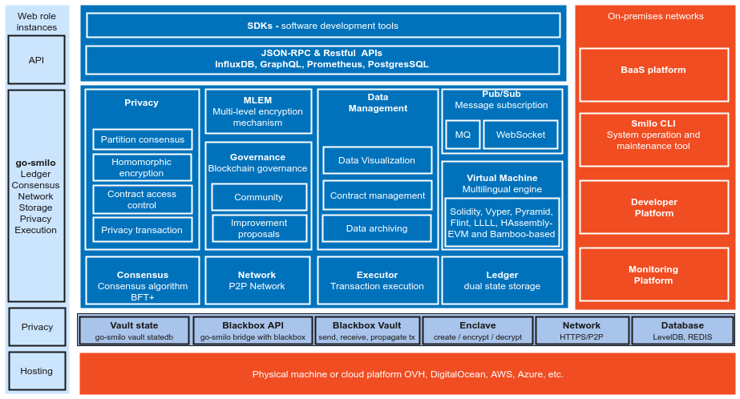
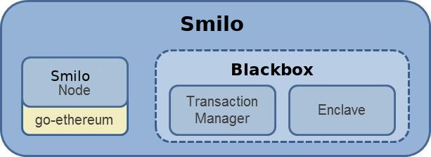
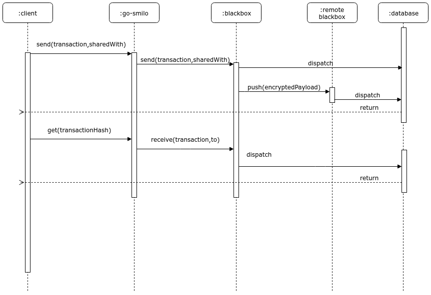

# 👋 Welcome!


## What is Smilo?
Smilo is an Ethereum-based distributed ledger protocol that has been developed to provide industries such as supply chain, gdpr compliant, finance, retail, real estate, etc. with a permissionless or permissioned implementation of Ethereum mixed with Smilo, Clearmatics and EtherZero that supports low cost, high transaction throughput and contract privacy.  

Founded 3 years ago, we envisioned a blockchain that would allow any individual to keep total control over its personal data without having to expose it openly. Our motivation came from the data breach scandals from all over the world. Governments, companies, NGO’s all got their clients/users/citizens’ personal data hacked over the last years. Millions of personal data files were hacked, abused, sold without consent of the individual. Our vision was that your personal data is as precious as your passport and you should keep it with you and only show it if needed for identification. No copies, no automatic consent, no exposure, no abuse.

We were looking to find a blockchain where we could build some sort of personal data wallet on. We started with Ethereum. Ethereum was and still is our great example of how a decentralized blockchain should work. It has smart contracts, high security, open source, sophisticated and stable technology. It’s challenges are the low throughput and the volatile transaction costs. What it also didn’t have was privacy. Every transaction and smart contract is public and for the right reasons. 

But understanding that privacy and data protection is becoming more and more important in the many cases in which individuals need to interact with organisations. At the same time data protection regulations such as GDPR and AVG have strongly influenced our thinking as well. 

Other players offering enterprise blockchain platforms are Corda, Hyperledger and Smilo but as they are private solutions for consortiums, these infrastructures need to be constantly secured and there is a high cost attached to it as well as a low throughput. 

At the other end there are public blockchains such as EOS and Ethereum that offer smart contracts but only public and as such open and exposed. Our solution combines both with the purpose to offer full autonomous data control for its users. 

So after extensive research we decided to build our own blockchain to be able to develop our concept of Smilo Private Smart Contracts (SPSC) on. With limited resources but also respecting the thousands of development, research and security hours of highly respected blockchains such as Ethereum, Smilo, Clearmatics and EtherZero, we have forked  and combined relevant elements of these codebases to develop what has evolved into the Smilo Hybrid Blockchain.

After over six months of extensive development, testing and more testing, the Smilo blockchain’s mainnet was launched on March 8th, 2019 as a cryptocurrency with a permissionless and decentralized network of users and developers. The Smilo development team succeeded to launch a 100%  open, public, border-less, censorship Resistant and neutral platform for private as well as public transactions and dito smart contracts. Smilo was launched without a premine, ICO, or founders rewards and relies to this date entirely on its community to support the long-term development of the project. There was never and will never be an ICO for Smilo. We are super proud to be a community driven project.




Since smilo includes a minimalistic fork of the [Go Ethereum client](https://github.com/ethereum/go-ethereum) (a.k.a geth) mixed with Smilo, Clearmatics and Etherzero, and as such, leverages the work that the Ethereum developer community has undertaken.  
 
The primary features of Smilo, and therefore extensions over public Ethereum, are:

* Transaction and contract privacy
* Multiple consensus mechanisms (Permission and Permissionless options)
* Network/Peer permissions management (With smart contracts)
* Staking or mining rewards
* High performance

!!! info "Background Reading"
    For more information on the design rationale and background to Smilo, please read the [**Smilo Whitepaper**](https://smilo.io/files/Smilo_White_Paper_Latest.pdf), view the [Enterprise Blockchain Comparison](https://drive.google.com/file/d/1kY_lh0qdIM6FA8qrIiPN4c8sADL5H2wm/view) and check the [Awesome Smilo Wiki](https://github.com/smilofoundation/Wiki/wiki/Awesome-Smilo---Links-and-resources). Also see quick presentation of Smilo at CES 2019 Las Vegas - US [here](https://www.youtube.com/watch?v=CQNJFRq2CLE)

## Smilo's components
### Logical architecture diagram




### Smilo Node
The Smilo Node is intentionally designed to be a lightweight fork of geth in order that it can continue to take advantage of the R&D that is taking place within the ever growing Ethereum community.  To that end, Smilo will be updated in-line with future geth releases.

The Smilo Node includes the following modifications to geth:

 * Consensus is achieved with the Raft or Istanbul BFT consensus algorithms instead of using Proof-of-Work.
 * The P2P layer has been modified to only allow connections to/from permissioned nodes.
 * The block generation logic has been modified to replace the ‘global state root’ check with a new ‘global public state root’.
 * The block validation logic has been modified to replace the ‘global state root’ in the block header with the ‘global public state root’
 * The State Patricia trie has been split into two: a public state trie and a private state trie.
 * Block validation logic has been modified to handle ‘Private Transactions’
 * Transaction creation has been modified to allow for Transaction data to be replaced by encrypted hashes in order to preserve private data where required
 * The pricing of Gas has been removed, although Gas itself remains

### Privacy Manager
The privacy manager options on Smilo are:
1. [Blackbox](https://github.com/smilofoundation/Smilo-blackbox) 
2. [Constellation](Privacy/Constellation/Constellation) (Integration WIP)
3. [Tessera](Privacy/Tessera/Tessera) (Integration WIP)

* Blackbox is a Golang implementation of the Smilo Vault Protocol. 
The available databases are: Redis, DynamoDB, and LevelDB.
Blackbox software was develop and is maintained by the Smilo community of developers.

* Constellation and Tessera are Haskell and Java implementations supported by Smilo team.
 
This 3 implementations are a general-purpose system for submitting information in a secure way.
 
They are comparable to a network of MTA (Message Transfer Agents) where messages are encrypted with PGP. It is not blockchain-specific, and are potentially applicable in many other types of applications where you want individually-sealed message exchange within a network of counterparties. The Constellation and Tessera modules consist of two sub-modules: 

* The Node (which is used for Smilo's default implementation of a `PrivateTransactionManager`) 
* The Enclave


#### Transaction Manager
Smilo’s Transaction Manager is responsible for Transaction privacy.  It stores and allows access to encrypted transaction data, exchanges encrypted payloads with other participant's Transaction Managers but does not have access to any sensitive private keys. It utilizes the Enclave for cryptographic functionality (although the Enclave can optionally be hosted by the Transaction Manager itself.)

The Transaction Manager is restful/stateless and can be load balanced easily.

For further details on how the Transaction Manager interacts with the Enclave, please refer [here](Privacy/Tessera/Tessera%20Services/Transaction%20Manager)




#### The Enclave

Distributed Ledger protocols typically leverage cryptographic techniques for transaction authenticity, participant authentication, and historical data preservation (i.e. through a chain of cryptographically hashed data.)  In order to achieve a separation of concerns, as well as to provide performance improvements through parallelization of certain crypto-operations, much of the cryptographic work including symmetric key generation and data encryption/decryption is delegated to the Enclave.  

The Enclave works hand in hand with the Transaction Manager to strengthen privacy by managing the encryption/decryption in an isolated way.  It holds private keys and is essentially a “virtual HSM” isolated from other components.

For further details on the Enclave, please refer [here](Privacy/Tessera/Tessera%20Services/Enclave).

## Design
### Public/Private State

Smilo supports dual state:

- Public state: accessible by all nodes within the network
- Private state: only accessible by nodes with the correct permissions

The difference is made through the use of transactions with encrypted (private) and non-encrypted payloads (public).
Nodes can determine if a transaction is private by looking at the `v` value of the signature.
Public transactions have a `v` value of `27` or `28`, private transactions have a value of `37` or `38`.

If the transaction is private, the node can only execute the transaction if it has the ability to access and decrypt the payload. Nodes who are not involved in the transaction do not have the private payload at all. As a result all nodes share a common public state which is created through public transactions and have a local unique private state.

This model imposes a restriction in the ability to modify state in private transactions.
Since it's a common use case for a (private) contract to read data from a public contract the virtual machine has the ability to jump into read only mode.
For each call from a private contract to a public contract the virtual machine will change to read only mode.
If the virtual machine is in read only mode and the code tries to make a state change the virtual machine stops execution and throws an exception.

The following transactions are allowed:

```
1. S -> A -> B
2. S -> (A) -> (B)
3. S -> (A) -> [B -> C]
```

and the following transaction are unsupported:

```
1. (S) -> A
2. (S) -> (A)
```

where:
- `S` = sender
- `(X)` = private
- `X` = public
- `->` = direction
- `[]` = read only mode

### State verification

To determine if nodes are in sync the public state root hash is included in the block.
Since private transactions can only be processed by nodes that are involved its impossible to get global consensus on the private state.

To overcome this issue the RPC method `eth_storageRoot(address[, blockNumber]) -> hash` can be used.
It returns the storage root for the given address at an (optional) block number.
If the optional block number is not given the latest block number is used.
The storage root hash can be on or off chain compared by the parties involved.
